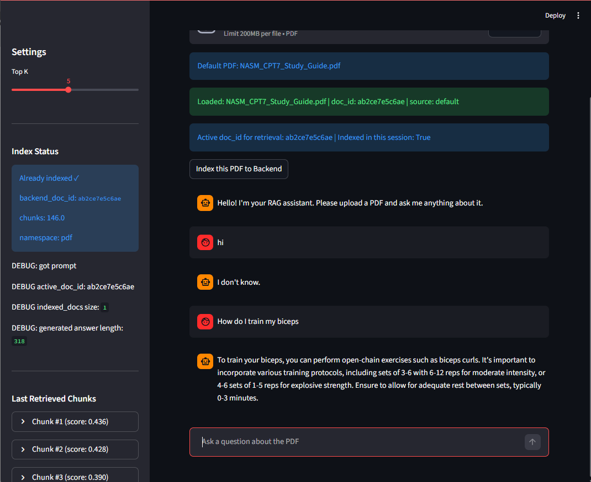

# RAG Demo App

A simple end-to-end **Retrieval-Augmented Generation (RAG)** demo built with:

- **Frontend**: Streamlit
- **Backend**: FastAPI
- **Document parsing**: PyPDF
- **(Planned)** Embedding + Vector DB (Pinecone)

This project demonstrates a full RAG pipeline:
PDF upload → text chunking → retrieval → answer generation.

# How to Run
Option A: 
- clone repo
- install requirement
- set environment variables
- run start.bat or manually run app.py and /backend/main

Option B:
- Backend deployed on Render: https://nasm-rag.onrender.com/
- Frontend deployed on Render: https://nasm-rag-frontend.onrender.com/
- Both deployed may requires account on render and needs to cold start for minutes.

# Future Improvement
- Better document management
- Let user upload pdf and use it locally without messing the general Vector DB
- Better chunking strategies to give accurate on identifying question range.

### Demo Screenshots

### User Interface
The Streamlit-based user interface allows users to upload PDF documents,
submit natural language questions, and view generated answers in real time.
It serves as the primary interaction layer between the user and the RAG system.

### RAG Question Answering
This example demonstrates the core RAG functionality.
User questions are answered based on the most relevant content retrieved
from the uploaded documents, ensuring responses are grounded in source material.

### Backend API
The backend is implemented using FastAPI and exposes endpoints for health checks,
document indexing, and question answering.

### deployments
Both the backend and frontend are deployed on Render.
The application is accessible through public endpoints and demonstrates
a complete deployment workflow from local development to cloud hosting.
Free-tier deployments may experience cold starts.
